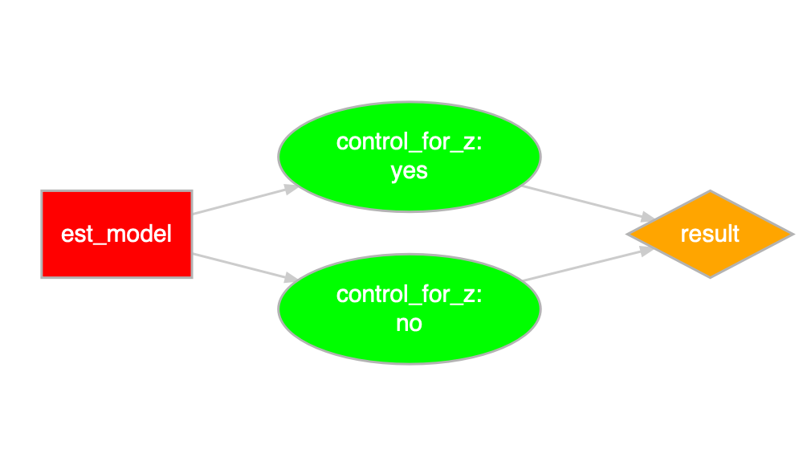
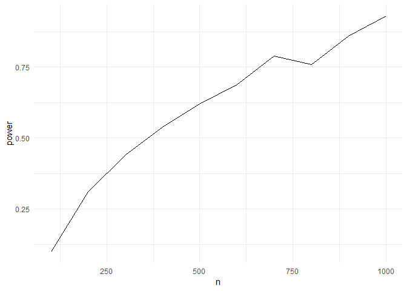

Joachim Gassen

Researcher Degrees of Freedom Analysis
======================================

A package to explore and document your degrees of freedom
---------------------------------------------------------

This experimental in-development package provides a set of functions to develop data analysis code that systematically documents researcher degrees of freedom when conducting analyses on observational data. The resulting code base is self-documenting, supports unit testing and power simulations based on simulated data. The documented researcher degrees of freedom can be exhausted to generate a distribution of outcome estimates.

To provide a quick tour we will construct a research design where an independent variable x is confounded by a co-variate z and where the only real researcher degree of freedom is whether to control for z in the regression setup. We will ignore the testing bit in this quick walk-through.

### Step 1: Open a new Rstudio project in a clean directory and install the `rdfanalysis` package

``` r
devtools:intall_github("joachim-gassen/rdfanalysis")
library(rdfanalysis)
```

### Step 2: Write a function that simulates data

``` r
sim_data <- function(n, effect_size) {
  z <- rnorm(n)
  x <- rnorm(n) + z 
  y <- effect_size*x + z + rnorm(n) 
  data.frame(x = x, y = y, z = z)
}
```

### Step 3: Define your research design by a series of functions

Each research design consists of a series of steps. Each step becomes a function. To initialize these functions, you can use the call `define_functions()`. It creates a `code` directory in your current working directory and produces template code for each step. In this case, our design will have only one step.

``` r
design <- define_design("est_model")
```

### Step 4: Develop your code for each step

Edit the resulting template file `est_model.R` in the code directory until it looks like the code below.

``` r
est_model <- function(input = NULL, choice = NULL) {
  step_description <- c(
    "## Estimate model",
    "### Content",
    "",
    "This step estimates on OLS model based on simulated data."
  )
  choice_description <- c(
    "### Choice",
    "",
    "A character value `control_for_z` that may take one of the following values:",
    "",
    "- `yes`: control for z",
    "- `no`: do not control for z"
  )
  choice_type <- list(
    list(name = "control_for_z", 
         type = "character", 
         valid_values = c("yes", "no"))
  )
  if (is.null(choice)) return(list(
    step_description = step_description,
    choice_description = choice_description,
    choice_type = choice_type
  )) else check_choice(choice, choice_type)

  # ___ Analysis code starts below ___
  if(choice[[1]] == "yes") 
    mod <- lm(y ~ x + z, data = input)
  else     mod <- lm(y ~ x, data = input)
  return(list(
    data = list(
      est = summary(mod)$coefficient[2,1],
      lb = confint(mod)[2,1],
      ub = confint(mod)[2,2]
    ),
    protocol = list(choice)
  ))  
} 
```

Step 5: Document your design and display a flow chart
-----------------------------------------------------

The below serves documentation purposes. The function `prepare_design_documentation()` generates a PDF file in your project directory that documents your code.

``` r
prepare_design_documentation(design, output_file = "my_design.pdf")
```

`prepare_design_flow_chart()` produces a quick visual of the code flow.

``` r
prepare_design_flow_chart(design, landscape = TRUE)
```



Step 6: Test your code
======================

``` r
test_design(design, input = sim_data(100, 0.1), reporter = "minimal")
```

    ## ........................

Step 7: Run a single protocol of choices
========================================

``` r
sim_data(100, 0.1) %>%
  est_model("yes")
```

    ## $data
    ## $data$est
    ## [1] -0.01334917
    ## 
    ## $data$lb
    ## [1] -0.2021778
    ## 
    ## $data$ub
    ## [1] 0.1754795
    ## 
    ## 
    ## $protocol
    ## $protocol[[1]]
    ## [1] "yes"

Step 8: Assess the power of your analysis for a certain protocol
================================================================

``` r
power_df <- simulate_design_power(design, protocol = list("yes"), 
                                  input_sim_func = sim_data, 
                                  range_n = seq(100, 1000, 100),
                                  effect_size = 0.1)

library(tidyverse)
power_df %>%
  group_by(n) %>%
  summarise(power = sum(lb > 0)/n()) %>%
  ggplot(aes(x = n, y = power)) +
  geom_line() + 
  theme_minimal()
```



Step 9: Exhaust your researcher degrees of freedom
==================================================

``` r
df <- exhaust_design(design, sim_data(100, 0.1)) 
```

``` r
kable(df)
```

| control\_for\_z |        est|         lb|         ub|
|:----------------|----------:|----------:|----------:|
| yes             |  0.2549365|  0.0495814|  0.4602916|
| no              |  0.6137394|  0.4332740|  0.7942047|

Only two researcher degrees of freedom in this setting but you will easily get into the thousands in a real research setting. Stay tuned for a vignette that presents a use case soon.
