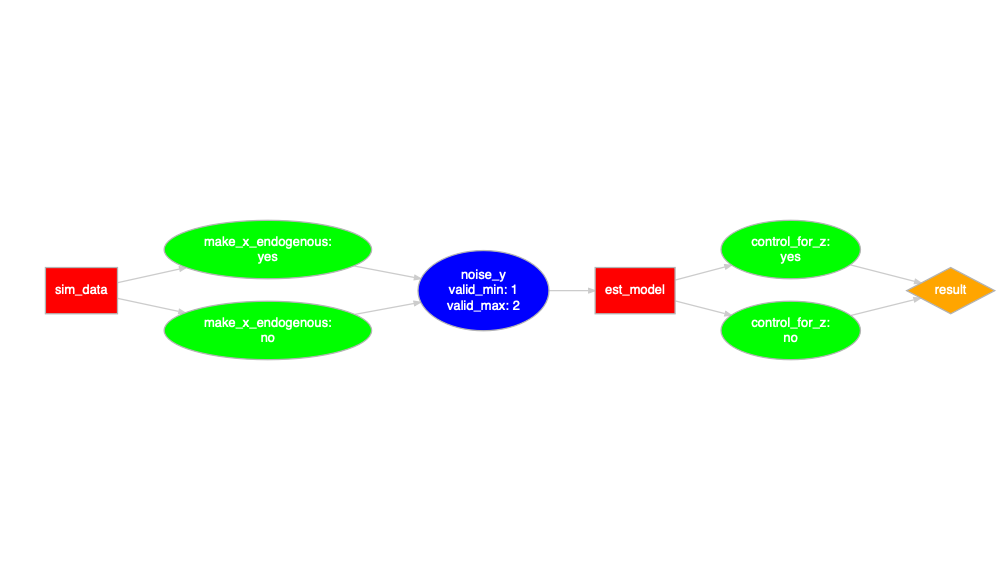
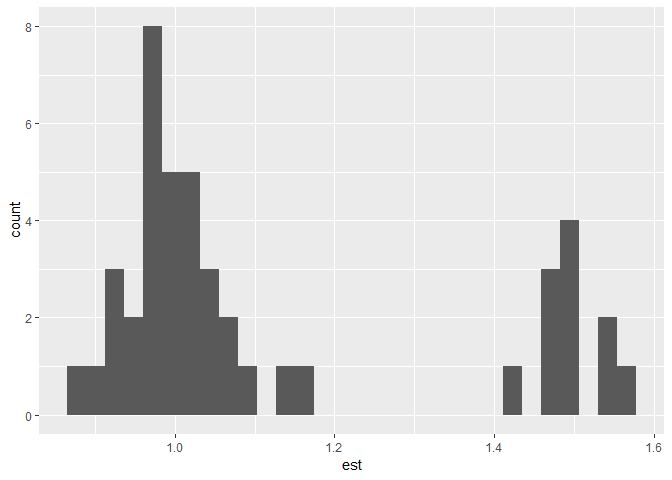

Joachim Gassen

Researcher Degrees of Freedom Analysis
======================================

A package to explore and document your degrees of freedom
---------------------------------------------------------

This experimental in-development package provides a set of functions to develop data anylsis code that systematically documents researcher degrees of freedom when conducting analyses on observational data. The resulting code base is self-documenting, supports unit testing and power simulations based on simulated data. The documented researcher degrees of freedom can be exhausted to generate a distribution of outcome estimates.

### First: Define your research design by a series of functions

``` r
sim_data <- function(input = NULL, choice = NULL) {
  step_description <- doc(
    "## Simulates Data",
    "### Content",
    "",
    "This step simulates some data.",
    "The used equation is $y = x + z + \\epsilon$",
    "with $z$ being $\\mathcal{N}(0,1)$ distributed and", 
    "$x$ being potentially endogenous to $z$ (see choices below)."
  )
  choice_description <- doc(
    "### Choice",
    "",
    "A list containing a character value `make_x_endogenous` and a numerical value `noise_y`.", 
    "`make_x_endogenous` may take one of the following values:",
    "",
    "- `yes`: $x$ will depend on $z$",
    "- `no`: $x$ will not depend on $z$",
    "",
    "`noise_y` sets the standard deviation of the error term $\\epsilon$ affecting y",
    "and may take any value within [1, 2]"
  )
  choice_type <- list(
    list(name = "make_x_endogenous", 
         type = "character", 
         valid_values = c("yes", "no")),
    list(name = "noise_y", 
         type = "double", 
         valid_min = 1, valid_max = 2)
  )
  if (is.null(choice)) return(list(
    step_description = step_description,
    choice_description = choice_description,
    choice_type = choice_type
  )) else check_choice(choice, choice_type)

  z <- rnorm(1000)
  x <- rnorm(1000) 
  if (choice[[1]] == "yes") x <- x + z
  y <- x + z + rnorm(1000, sd = choice[[2]]) 
  return(list(
    data = data.frame(x = x, y = y, z = z),
    protocol = choice
  ))
}


est_model <- function(input = NULL, choice = NULL) {
  step_description <- doc(
    "## Estimate model",
    "### Content",
    "",
    "This step estimates on OLS model based on the simulated data of the last step."
  )
  choice_description <- doc(
    "### Choice",
    "",
    "A character value `control_for_z` that may take one of the following values:",
    "",
    "- `yes`: control for z",
    "- `no`: do not control for z"
  )
  choice_type <- list(
    list(name = "control_for_z", 
         type = "character", 
         valid_values = c("yes", "no"))
  )
  if (is.null(choice)) return(list(
    step_description = step_description,
    choice_description = choice_description,
    choice_type = choice_type
  )) else check_choice(choice, choice_type)

  if(choice[[1]] == "yes") 
    mod <- lm(y ~ x + z, data = input$data)
  else     mod <- lm(y ~ x, data = input$data)
  return(list(
    data = list(
      est = summary(mod)$coefficient[2,1],
      lb = confint(mod)[2,1],
      ub = confint(mod)[2,2]
    ),
    protocol = c(input$protocol, choice)
  ))  
} 

design <- c("sim_data", "est_model")
```

Second: Display your design and verify it by testing it
-------------------------------------------------------

``` r
prepare_design_flow_chart(design, landscape = TRUE)
```



``` r
test_design(design, reporter = "minimal")
```

    ## ......................................................

Third: Run a single protocol
============================

``` r
sim_data(NULL, list("no", 2)) %>%
  est_model("no")
```

    ## $data
    ## $data$est
    ## [1] 1.003213
    ## 
    ## $data$lb
    ## [1] 0.8590349
    ## 
    ## $data$ub
    ## [1] 1.147392
    ## 
    ## 
    ## $protocol
    ## $protocol[[1]]
    ## [1] "no"
    ## 
    ## $protocol[[2]]
    ## [1] 2
    ## 
    ## $protocol[[3]]
    ## [1] "no"

Fourth: Exhaust your researcher degrees of freedom
==================================================

``` r
df <- exhaust_design(design, NULL) 
```

``` r
plot_rdf_estimates(df, est = "est", lb = "lb", ub = "ub")
```



``` r
kable(df)
```

| make\_x\_endogenous |  noise\_y| control\_for\_z |        est|         lb|        ub|
|:--------------------|---------:|:----------------|----------:|----------:|---------:|
| yes                 |       1.0| yes             |  0.9938457|  0.9300187|  1.057673|
| no                  |       1.0| yes             |  1.0063158|  0.9420225|  1.070609|
| yes                 |       1.1| yes             |  1.0066282|  0.9403908|  1.072866|
| no                  |       1.1| yes             |  1.0341385|  0.9675916|  1.100685|
| yes                 |       1.2| yes             |  1.0298276|  0.9534443|  1.106211|
| no                  |       1.2| yes             |  0.9495168|  0.8766786|  1.022355|
| yes                 |       1.3| yes             |  0.9572820|  0.8775360|  1.037028|
| no                  |       1.3| yes             |  1.0708750|  0.9948200|  1.146930|
| yes                 |       1.4| yes             |  1.0716710|  0.9823343|  1.161008|
| no                  |       1.4| yes             |  1.0423109|  0.9571270|  1.127495|
| yes                 |       1.5| yes             |  0.9912420|  0.8993050|  1.083179|
| no                  |       1.5| yes             |  0.9828939|  0.8929733|  1.072815|
| yes                 |       1.6| yes             |  1.0186492|  0.9222817|  1.115017|
| no                  |       1.6| yes             |  1.0166883|  0.9203140|  1.113063|
| yes                 |       1.7| yes             |  1.0482291|  0.9435789|  1.152879|
| no                  |       1.7| yes             |  1.0508958|  0.9431385|  1.158653|
| yes                 |       1.8| yes             |  1.1262149|  1.0106731|  1.241757|
| no                  |       1.8| yes             |  0.9538012|  0.8488329|  1.058769|
| yes                 |       1.9| yes             |  0.9278975|  0.8063315|  1.049464|
| no                  |       1.9| yes             |  0.9939829|  0.8727362|  1.115230|
| yes                 |       2.0| yes             |  0.9844747|  0.8570688|  1.111881|
| no                  |       2.0| yes             |  0.8940731|  0.7730708|  1.015075|
| yes                 |       1.0| no              |  1.4705381|  1.4150559|  1.526020|
| no                  |       1.0| no              |  1.0510046|  0.9620269|  1.139982|
| yes                 |       1.1| no              |  1.4486965|  1.3896248|  1.507768|
| no                  |       1.1| no              |  0.9177761|  0.8272609|  1.008291|
| yes                 |       1.2| no              |  1.4681268|  1.4062359|  1.530018|
| no                  |       1.2| no              |  0.9654459|  0.8705654|  1.060326|
| yes                 |       1.3| no              |  1.4723627|  1.4067055|  1.538020|
| no                  |       1.3| no              |  0.9157897|  0.8107788|  1.020801|
| yes                 |       1.4| no              |  1.5112444|  1.4415575|  1.580931|
| no                  |       1.4| no              |  0.9762966|  0.8747530|  1.077840|
| yes                 |       1.5| no              |  1.4802517|  1.4056005|  1.554903|
| no                  |       1.5| no              |  0.9402648|  0.8342032|  1.046326|
| yes                 |       1.6| no              |  1.5407626|  1.4601397|  1.621385|
| no                  |       1.6| no              |  0.9576015|  0.8427788|  1.072424|
| yes                 |       1.7| no              |  1.4836064|  1.4038871|  1.563326|
| no                  |       1.7| no              |  0.9085674|  0.7852228|  1.031912|
| yes                 |       1.8| no              |  1.5953858|  1.5119380|  1.678834|
| no                  |       1.8| no              |  1.0971184|  0.9732387|  1.220998|
| yes                 |       1.9| no              |  1.5364045|  1.4473557|  1.625453|
| no                  |       1.9| no              |  1.0875138|  0.9505899|  1.224438|
| yes                 |       2.0| no              |  1.5964426|  1.5000226|  1.692863|
| no                  |       2.0| no              |  0.9729406|  0.8315836|  1.114298|
