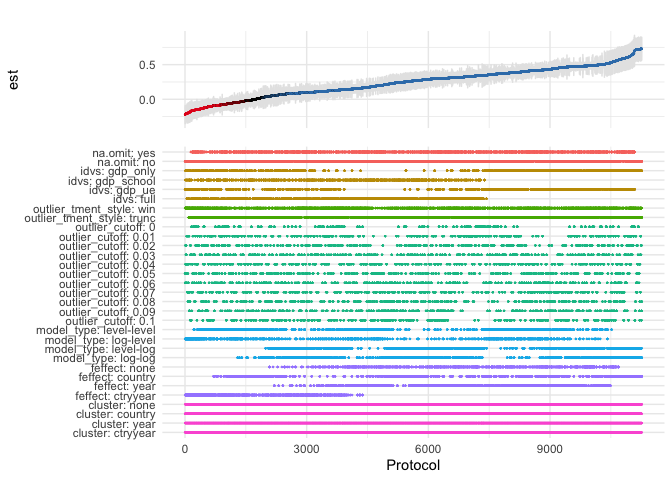

Joachim Gassen

# Researcher Degrees of Freedom Analysis

## A package to explore and document your degrees of freedom

This in-development package provides a coding infrastructure that allows
researchers to systematically document and explore their researcher
degrees of freedom when conducting analyses on observational data. The
resulting code base is self-documenting, supports unit testing and power
simulations based on simulated data. The documented researcher degrees
of freedom can be exhausted to generate a distribution of outcome
estimates.

### New: Plot a specification curve

The below displays a specification curve ([Simonsohn, Simmons and
Nelson](https://papers.ssrn.com/sol3/papers.cfm?abstract_id=2694998))
based on an systematic exploration of the Preston curve. It summarizes
11,264 regressions in one plot. See this [blog
article](https://joachim-gassen.github.io/2019/04/11264-regressions-in-one-tidy-plot/)
and this
[vignette](https://joachim-gassen.github.io/rdfanalysis/articles/analyzing_rdf.html)
for more detail. While the code works with the result data frame created
following the procedure below, it also works on data frames that contain
choices and coefficient estimates created by other means.

``` r
# devtools::install_github("joachim-gassen/rdfanalysis")
library(rdfanalysis)
load(url("https://joachim-gassen.github.io/data/rdf_ests.RData"))
plot_rdf_spec_curve(ests, "est", "lb", "ub") 
```

<!-- -->

### Even newer: Let your researcher’s degrees of freedom shine!

To explore your specification curve you can also use a shiny frontend
that is included with the package. If you use the coding infrastructure
from the package it even allows you to interactively explore your
findings from a single regression output to the full specification
curve. [See for
yourself](https://jgassen.shinyapps.io/shiny_rdf_spec_curve).

``` r
# devtools::install_github("joachim-gassen/rdfanalysis")
library(rdfanalysis)
load(url("https://joachim-gassen.github.io/data/rdf_ests.RData"))

# The following is based on having a local fork of the repo. See the
# vignettes of the package to learn more about how to use the full
# rdfanalsis package.

design <- define_design(steps = c("read_data",
                                  "select_idvs",
                                  "treat_extreme_obs",
                                  "specify_model",
                                  "est_model"),
                        rel_dir = "vignettes/case_study_code")

shiny_rdf_spec_curve(ests, list("est", "lb", "ub"),
                     design, "vignettes/case_study_code",
                     "https://joachim-gassen.github.io/data/wb_new.csv")
```


## A Package Tour

To provide a quick tour of the full package and its workflow I will use
a “research design” where an independent variable x is confounded by a
co-variate z and where the only researcher degree of freedom is whether
to control for z in the regression setup. We will ignore the testing bit
in this quick walk-through.

For a more in-depth introduction into the package, please refer to the
[vignette included in the
documentation](https://joachim-gassen.github.io/rdfanalysis/articles/analyzing_rdf.html).

### Step 1: Open a new Rstudio project in a clean directory and install the `rdfanalysis` package

``` r
devtools::install_github("joachim-gassen/rdfanalysis")
library(rdfanalysis)
```

### Step 2: Write a function that simulates data

``` r
sim_data <- function(n, effect_size) {
  z <- rnorm(n)
  x <- rnorm(n) + z 
  y <- effect_size*x + z + rnorm(n) 
  data.frame(x = x, y = y, z = z)
}
```

### Step 3: Define your research design by a series of functions

Each research design consists of a series of steps. Each step becomes a
function. To initialize these functions, you can use the call
`define_design()`. It creates a `code` directory in your current working
directory and produces template code for each step. In this case, our
design will have only one step.

``` r
design <- define_design("est_model")
```

### Step 4: Develop your code for each step

Edit the resulting template file `est_model.R` in the code directory
until it looks like the code below.

``` r
est_model <- function(input = NULL, choice = NULL) {
  step_description <- c(
    "## Estimate model",
    "### Content",
    "",
    "This step estimates on OLS model based on simulated data."
  )
  choice_description <- c(
    "### Choice",
    "",
    "A character value `control_for_z` that may take one of the following values:",
    "",
    "- `yes`: control for z",
    "- `no`: do not control for z"
  )
  choice_type <- list(
    list(name = "control_for_z", 
         type = "character", 
         valid_values = c("yes", "no"))
  )
  if (is.null(choice)) return(list(
    step_description = step_description,
    choice_description = choice_description,
    choice_type = choice_type
  )) else check_choice(choice, choice_type)

  # ___ Analysis code starts below ___
  if(choice[[1]] == "yes") 
    mod <- lm(y ~ x + z, data = input)
  else     mod <- lm(y ~ x, data = input)
  return(list(
    data = list(
      est = summary(mod)$coefficient[2,1],
      lb = confint(mod)[2,1],
      ub = confint(mod)[2,2]
    ),
    protocol = list(choice)
  ))  
} 
```

### Step 5: Source your code

``` r
source_design(design)
```

### Step 6: Test your code

``` r
test_design(design, input = sim_data(100, 0.1), reporter = "minimal")
```

    ## ........................

### Step 7: Document your design

The below serves documentation purposes. The function
`prepare_design_documentation()` generates a PDF file in your project
directory that documents your code. For it to work you need a local
`R Markdown` installation that is capable to produce PDF files.

``` r
prepare_design_documentation(design, output_file = "my_design.pdf")
```

`prepare_design_flow_chart()` produces a quick visual of the code flow.

``` r
prepare_design_flow_chart(design, landscape = TRUE)
```

<!-- -->

### Step 8: Run a single protocol of choices

``` r
sim_data(100, 0.1) %>%
  est_model("yes")
```

    ## $data
    ## $data$est
    ## [1] 0.1762571
    ## 
    ## $data$lb
    ## [1] -0.03138844
    ## 
    ## $data$ub
    ## [1] 0.3839027
    ## 
    ## 
    ## $protocol
    ## $protocol[[1]]
    ## [1] "yes"

### Step 9: Assess the power of your analysis for a certain protocol

``` r
power_df <- simulate_design_power(design, protocol = list("yes"), 
                                  input_sim_func = sim_data, 
                                  range_n = seq(100, 1000, 100),
                                  effect_size = 0.1)

library(tidyverse)
power_df %>%
  group_by(n) %>%
  summarise(power = sum(lb > 0)/n()) %>%
  ggplot(aes(x = n, y = power)) +
  geom_line() + 
  theme_minimal()
```

<!-- -->

### Step 10: Exhaust your researcher degrees of freedom

``` r
df <- exhaust_design(design, sim_data(1000, 0.1)) 
```

``` r
kable(df)
```

| control_for_z |       est |       lb |        ub |
|:--------------|----------:|---------:|----------:|
| yes           | 0.1372860 | 0.078503 | 0.1960689 |
| no            | 0.5653054 | 0.513296 | 0.6173148 |

Only two researcher degrees of freedom in this setting but you will
easily get into the thousands in a real research setting. For a
real-life case study on how to use `rdfanalysis`, please refer to the
[vignette included in the
documentation](https://joachim-gassen.github.io/rdfanalysis/articles/analyzing_rdf.html).

## Project Funding

This is a project of the [Open Science Data
Center](https://www.accounting-for-transparency.de/projects/open-science-data-center/)
and funded by the [Deutsche Forschungsgemeinschaft (DFG, German Research
Foundation)](https://www.dfg.de/en/index.jsp): [Project-ID 403041268 –
TRR 266 Accounting for
Transparency](https://www.accounting-for-transparency.de).
